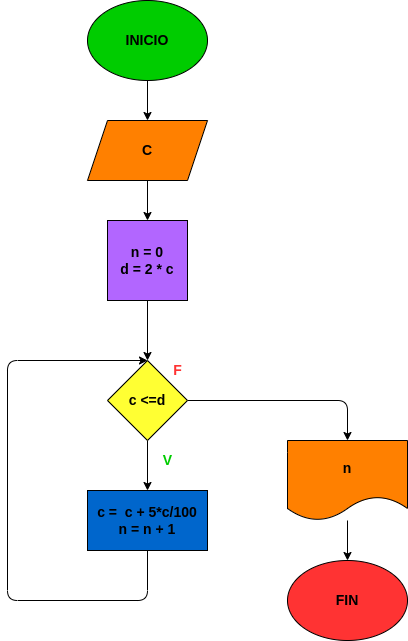

# Interes_compuesto
## Hacer el diagrama de flujo y el programa en python, que lea un capital c, y que averigue el prima en cuantos meses se duplica si lo colocamos a un interes compuesto del 5% mensual

# ANALISIS

Variables de entrada (input)

c = La capital inicial

Variables de proceso (processing)

n = El numero de meses que a transcurrido (n=0)

d = Al doble producto de la capital inicial (2*c)

c < d = Limita el programa hasta que la capital inicial supere a (d)

# OUTPUT

C = c + 5*c/100 = El doble producto del capital inicial

n = n + 1 = Los meses que antranscurrido

# DISEÑO

# CONSTRCCION